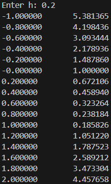
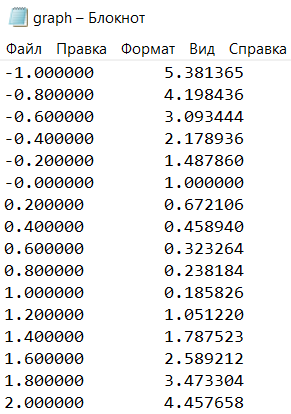
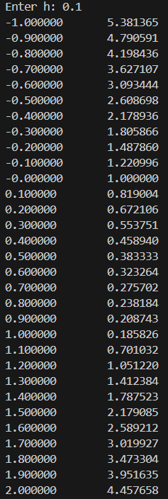
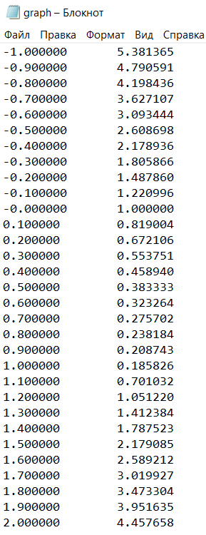

# Лабораторная работа №2 | 7-ой вариант
## Задание
1) Напишите программу по варианту, используя оператор цикла ``while`` (нечётные варианты) или ``do while`` (чётные варианты).
2) Напишите программу, используя оператор цикла ``for``.
3) Постройте график с использованием gnuplot.
4) Составьте блок-схемы.
5) формите отчёт в README.md. Отчёт должен содержать:
- Задание
- Описание проделанной работы
- Скриншоты результатов
- Блок-схемы
- График функции
- Ссылки на используемые материалы

## Описание проделанной работы
- Написал код с циклом ``while``:

- Также написал код с циклом ``for``:

- Установил **gnuplot**, добавил его как среду разроботки **windows** и скачал расширения в **VSC**
- Создал текстовый файл для сохранения вывода
- Сделал график с помощью команды ``gnuplot graphs.gnu``
- Сделал отсчет

## Скриншоты результатов 
### Цикл ``while``:
- В командной строке:

- В текстовом документе:

### Цикл ``for`` :
- В командной строке:

- В текстовом документе:

## Блок схемы
### Для цикла ``while``:

### Для цикла ``for``:

## График функции

## Ссылки на используемые материалы
- https://stackoverflow.com/questions/74930588/gnuplot-setup-vs-code/79056576#79056576 
- https://stackoverflow.com/questions/22615251/gnuplot-bad-data-on-line-1
- https://younglinux.info/c/fopen
- https://codelessons.dev/ru/fprintf-in-c-cplusplus/
- https://habr.com/ru/companies/ruvds/articles/517450/
- https://www.youtube.com/watch?v=mYBr-Yb70Z4&ab_channel=oxyscbw
